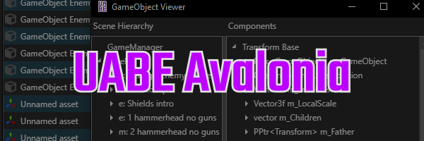

## UABEAvalonia

Cross-platform Asset Bundle/Serialized File reader and writer. Originally based on (but not a fork of) [UABE](https://github.com/SeriousCache/UABE).

## Libraries

- [Avalonia](https://github.com/AvaloniaUI/Avalonia) (MIT license)
  - [Dock.Avalonia](https://github.com/wieslawsoltes/Dock) (MIT license)
  - [AvaloniaEdit](https://github.com/AvaloniaUI/AvaloniaEdit) (MIT license)
- [AssetsTools.NET](https://github.com/nesrak1/AssetsTools.NET/tree/upd21-with-inst) (MIT license)
  - [Cpp2IL](https://github.com/SamboyCoding/Cpp2IL) (MIT license)
  - [Mono.Cecil](https://github.com/jbevain/cecil) (MIT license)
  - [AssetRipper.TextureDecoder](https://github.com/AssetRipper/TextureDecoder) (MIT license)
- [ISPC Texture Compressor](https://github.com/GameTechDev/ISPCTextureCompressor) (MIT license)
- [Unity crnlib](https://github.com/Unity-Technologies/crunch/tree/unity) (zlib license)
- [PVRTexLib](https://developer.imaginationtech.com/pvrtextool) (PVRTexTool license)
- [ImageSharp](https://github.com/SixLabors/ImageSharp) (Apache License 2.0)
- [Fsb5Sharp](https://github.com/SamboyCoding/Fmod5Sharp) (MIT license)
- [Font Awesome](https://fontawesome.com) (CC BY 4.0 license)
